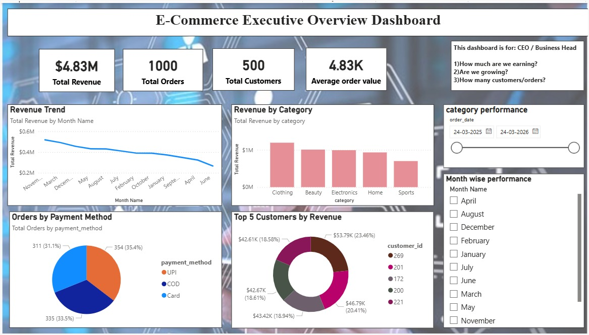
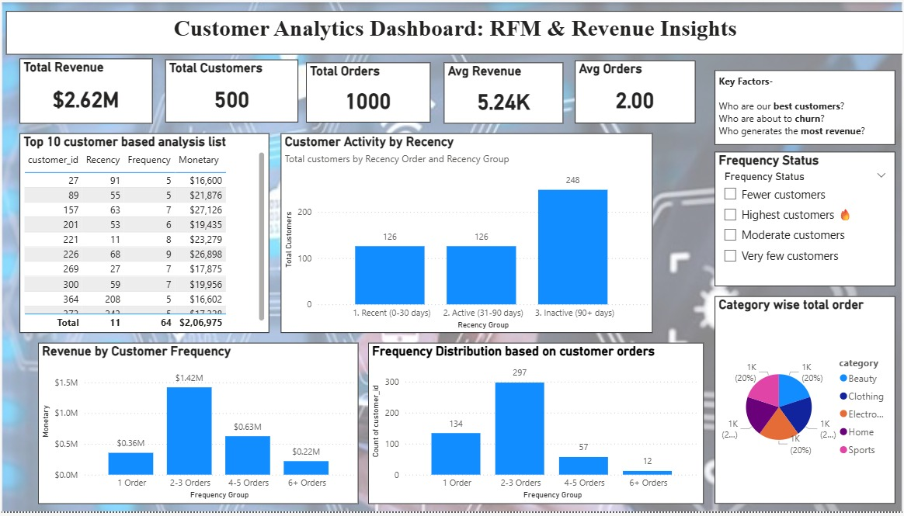
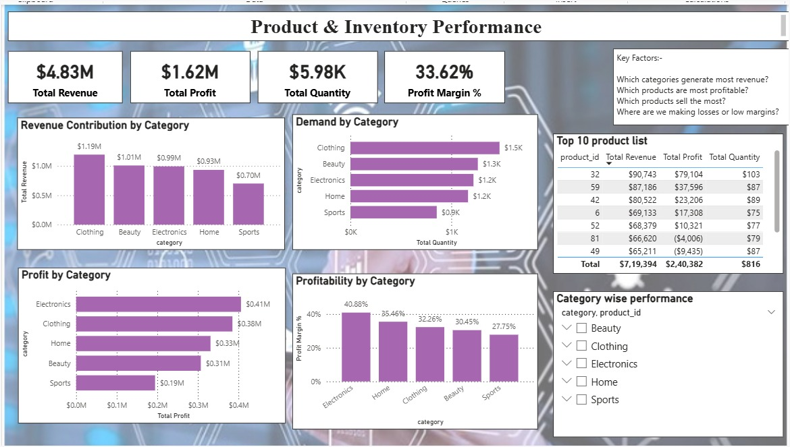
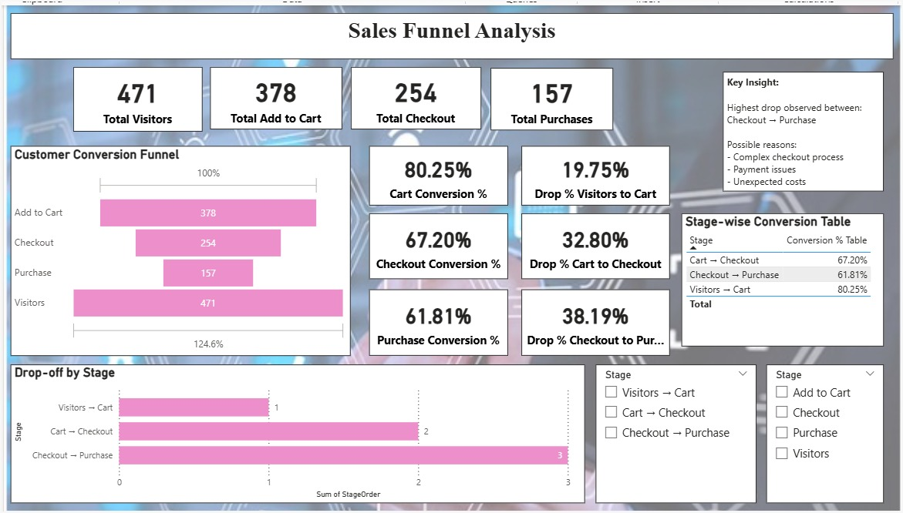
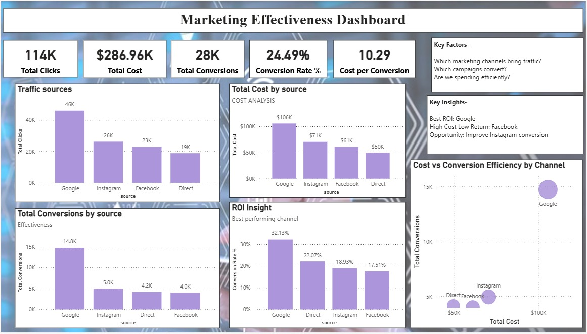

# 📊 E-Commerce Insights: Customer Behavior & Revenue Optimization

## 🎯 Business Problem
An e-commerce company is facing:
- High cart abandonment
- Low customer retention
- Inefficient marketing spend

This project analyzes customer behavior and business performance to improve revenue.

---

## 🛠 Tools Used
- Power BI  
- DAX  
- Excel  

---

## 📊 Dashboards

### 1. Executive Overview

---

### 2. Customer Analytics

---

### 3. Product Performance

---

### 4. Funnel Analysis

---

### 5. Marketing Effectiveness

---

## 🔍 Key Insights
- Checkout stage has highest drop-off (~38%)
- Repeat customers generate most revenue
- Some campaigns are inefficient

---

## 🚀 Business Recommendations
- Improve checkout experience
- Focus on high ROI channels
- Retain repeat customers
